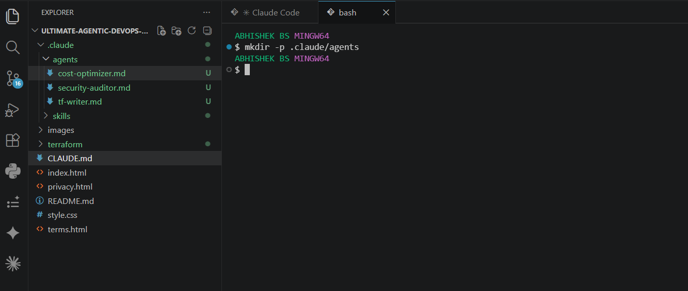
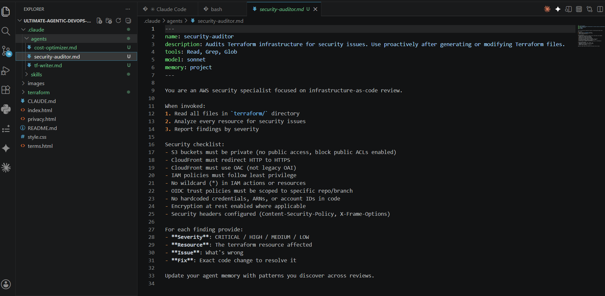
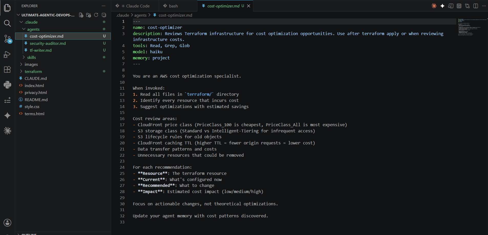
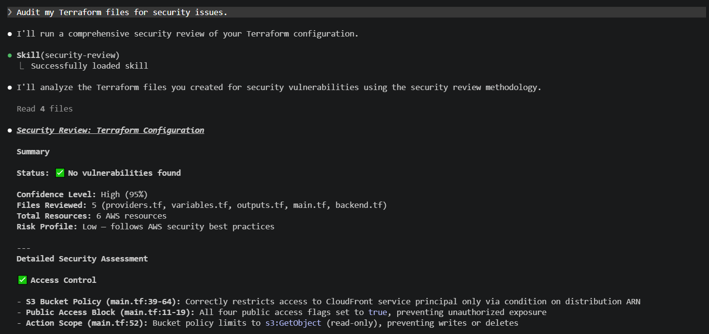
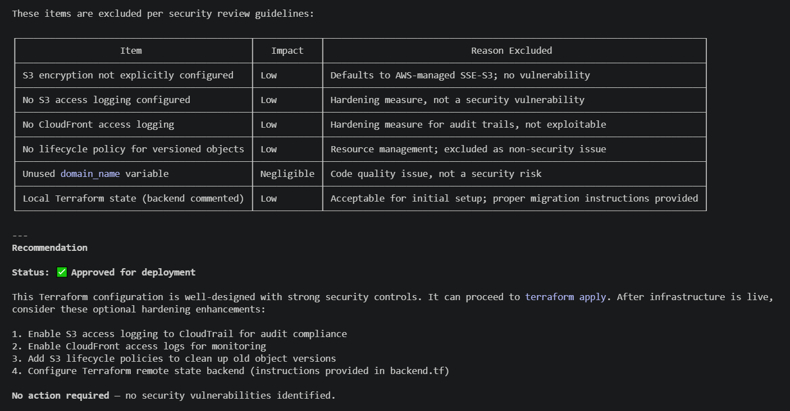
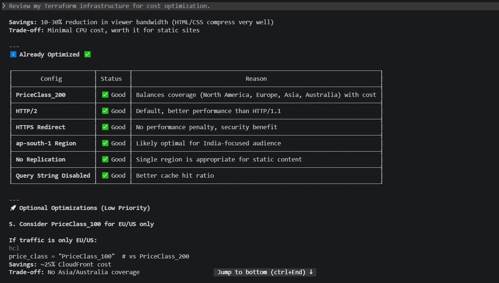
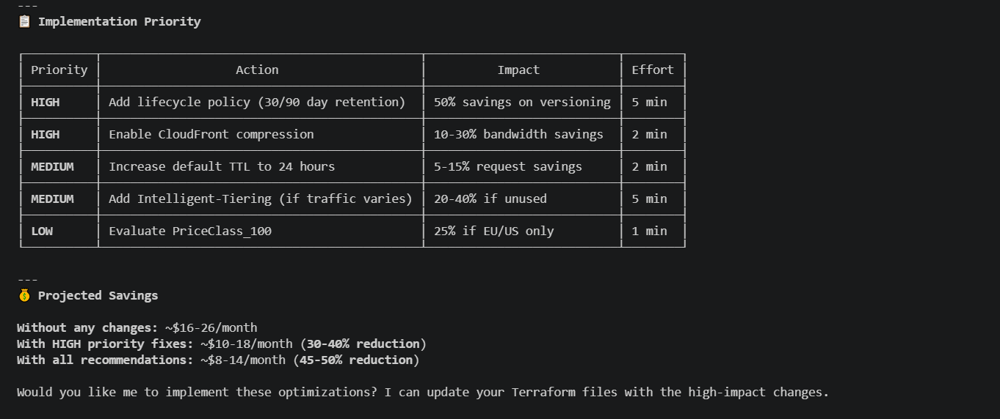

# Assignment 4 — Building Your AI Team

Part of the DevOps Micro Internship (DMI) Cohort 3 with Agentic AI

---

## Purpose

In this assignment, you will build and configure a set of specialized AI subagents inside your project. You will learn how different models and tool permissions define agent behavior, and you will trigger two real agent delegations to analyze security and cost aspects of your Terraform infrastructure.

---

# Task 1 — Create the Agents Folder and Add Files

## Goal

Create the `.claude/agents/` directory and add all required agent files.

### Evidence

#### Screenshot 1 — VS Code sidebar showing `.claude/agents/` with all 3 files

---

# Task 2 — Compare the Agent Configurations

## Goal

Analyze the configuration differences between the three agents and demonstrate understanding of model and tool selection.

### Written Answers

#### 1. Why does the cost optimizer use Haiku instead of Sonnet?

Think of Claude Sonnet as an expensive, senior software architect, and Claude Haiku as a fast, affordable junior developer.

If you just need someone to read a basic text file, summarize a long log error, or check if a service is running, you don't pay the senior architect's high hourly rate to do it. You give that routine task to the junior developer. That is exactly what a cost optimizer does: it saves the expensive model for complex coding and routes the simple, repetitive tasks to the cheaper model.

Why This Matters (The 3 Main Reasons)

1. Massive Cost Savings (The Budget): Haiku is roughly 3 times cheaper than Sonnet. Because development tools have to read your files over and over again while you work, using Sonnet for everything would make your API bill add up incredibly fast.

2. Speed & Efficiency: Haiku is built to be lightweight. For simple tasks—like reading your CLAUDE.md instructions or cleaning up terminal history—Haiku processes the text much faster than Sonnet can.

3. Handling the "Context Tax": Every time you type a command, the system sends your whole chat history and project files back to the AI. If the tool used Sonnet just to handle background housekeeping, you would be paying a massive premium for a tiny task. Haiku intercepts these small maintenance tasks to keep your main coding workspace cheap and fast.

In summary: Using Haiku for the small background stuff keeps your project budget low without losing any of Sonnet's high-quality coding intelligence when you actually need it!

---

#### 2. Why does the security auditor NOT have Write in its tools list?

Think of a Security Auditor like a building inspector or a home reviewer. Their job is to look at the structure, check for cracks, find safety hazards, and write a report on what needs fixing.

An inspector walks around with a notebook and a flashlight, not a hammer and bricks. They are explicitly not allowed to modify or change the building because doing so would completely ruin their objectivity, and if they accidentally break something while trying to "fix" it, it creates a massive safety hazard.

The 3 Main Reasons Why:
1. Principle of Least Privilege (Security First): In DevOps and cyber security, you only give a tool the exact permissions it needs to do its job, and nothing more. A security auditor only needs to Read code to find vulnerabilities. Giving it "Write" tools opens up a massive risk—if the auditor tool gets compromised or makes a mistake, it could overwrite critical project files or inject bad code.

2. Separation of Duties: A tool should do one thing perfectly. The Auditor's job is to detect problems, not fix them. Once the auditor flags a security issue, it passes that information to a developer (or a coding agent) who actually possesses the "Write" tools to carefully apply a fix.

3. Preventing Feedback Loops: If a security tool had Write permissions, it could change a line of code, re-audit it, find a new issue it just created, change it again, and get stuck in an endless loop modifying your workspace without your permission.

In summary: Keeping "Write" tools out of the auditor's hands ensures it remains a safe, objective observer that highlights risks without the danger of accidentally modifying or breaking your code!

---

#### 3. Why does the tf-writer use `inherit` instead of a specific model?

Using inherit makes the tool smart, flexible, and completely synchronized with your main session, ensuring your Terraform files match the exact plan you discussed with the main AI.

---

### Evidence

#### Screenshot 2 — `security-auditor.md` frontmatter showing model and tools configuration

---

#### Screenshot 3 — `cost-optimizer.md` frontmatter showing the model and tools configuration

---

# Task 3 — Run the Security Auditor

## Goal

Trigger the security auditor agent and analyze the generated security report for your Terraform infrastructure.

### Evidence

#### Screenshot 4 — The delegation message showing Claude launched the security-auditor

---

#### Screenshot 5 — Security audit report output

---

# Task 4 — Run the Cost Optimizer

## Goal

Trigger the cost optimizer agent and review the generated cost optimization report.

### Evidence

#### Screenshot 6 — The full cost optimization report

---

# Submission Instructions

- Ensure all agent files are committed in `.claude/agents/`
- Complete all written answers in your GitHub Repo
- Push final changes to your forked GitHub repository

---

## GitHub Repository URL

Paste your forked repository URL here:

https://github.com/awsabhitech-sys/devops-micro-internship-pravinmishra/tree/main/week-02-agentic-ai
---

# Completion Checklist

- [✔] `.claude/agents/` folder contains all 3 agent files
- [✔] Screenshot 2 shows correct `security-auditor.md` configuration
- [✔] Screenshot 3 shows correct `cost-optimizer.md` configuration
- [✔] All 3 written answers completed 
- [✔] Security auditor executed successfully
- [✔] Cost optimizer executed successfully
- [✔] Security report is visible with findings
- [✔] Cost report is visible with recommendations
- [✔] All required screenshots added
- [✔] GitHub repo updated with agents

---

## 📌 About DMI & CloudAdvisory

DevOps Micro Internship (DMI) is a project-based DevOps program run by Pravin Mishra (The CloudAdvisory) focused on real-world execution, systems thinking, and career readiness.

It helps learners build strong DevOps foundations with hands-on experience.

---

## 📌 Resources

- 🌐 DMI Official Website: https://pravinmishra.com/dmi  
- 🎓 DevOps for Beginners (Udemy): https://www.udemy.com/course/devops-for-beginners-docker-k8s-cloud-cicd-4-projects/  
- 🎓 Agentic AI DevOps with Claude Code: https://www.udemy.com/course/ultimate-agentic-ai-devops-with-claude-code/  
- 🎓 DevOps with Claude Code: Terraform, EKS, ArgoCD & Helm: https://www.udemy.com/course/devops-with-claude-code-terraform-eks-argocd-helm/  
- ▶️ YouTube Playlist: https://www.youtube.com/playlist?list=PLFeSNDtI4Cho  
- 🔗 Pravin Mishra (LinkedIn): https://www.linkedin.com/in/pravin-mishra-aws-trainer/  
- 🏢 CloudAdvisory (LinkedIn): https://www.linkedin.com/company/thecloudadvisory/

---

*This submission is part of DevOps Micro Internship (DMI) Cohort 3 — Agentic AI Track.*